<div align="center">



[](https://hojiakbar.blog)
[](https://t.me/Hojiakbar4770)
[](mailto:hhabibullayev075@gmail.com)

</div>

```python
# python -i hojiakbar.py
class HojiakbarHabibullayev:
    """Backend & AI Developer — Uzbekistan."""

    languages = ["Python", "JavaScript", "Go"]
    backend   = ["Django", "DRF", "FastAPI", "aiogram"]
    frontend  = ["Next.js", "Tailwind"]
    data      = ["PostgreSQL", "Redis", "Docker"]
    ai        = ["LLM APIs", "computer vision", "RAG pipelines"]

    def ship(self, idea):
        while not idea.solves_real_problem():
            idea = self.rethink(idea)
        return self.build(idea)   # clean, extensible, deployed


>>> me = HojiakbarHabibullayev()
>>> me.ship("your project")
```

## ~/projects

| | Project | What it does | Stack |
|--|---------|--------------|-------|
| `▲` | [**hojiakbar.blog**](https://hojiakbar.blog) | Personal portfolio + blog — decoupled architecture, i18n (UZ/EN/RU), dark mode, SEO | Django + DRF · Next.js · PostgreSQL |
| `●` | **Kinesis** | Clinic management for a kinesiology practice: desktop app, Telegram bot, receipt printing | FastAPI · SQLAlchemy 2.0 · aiogram · Flet |
| `●` | **CTC-CRM** | CRM/LMS for a teaching center: modular monolith, background jobs, mobile app | Django 5 · Celery/Redis · Expo |
| `◆` | **drq** | Self-hosted HTTP tunneling (ngrok-style), server + CLI | Go · WebSockets · PostgreSQL |
| `▲` | [**tahlil**](https://github.com/hojiakbar-python/tahlil) | Chest X-ray analysis: tuberculosis, pneumonia, pneumothorax detection | PyTorch · TorchXRayVision |

<sub>`▲` open source · `●` client work (closed source, [write-ups on the blog](https://hojiakbar.blog/projects)) · `◆` self-hosted tool</sub>

## ~/stats

<div align="center">


</div>

## ~/now

```diff
+ building Telegram bots, REST APIs and AI-powered products
+ writing about real projects at hojiakbar.blog
! open to interesting backend / bot / AI work — ping me on Telegram
```

<div align="center">
<sub><code>while alive: learn(); build(); ship()</code></sub>
</div>
